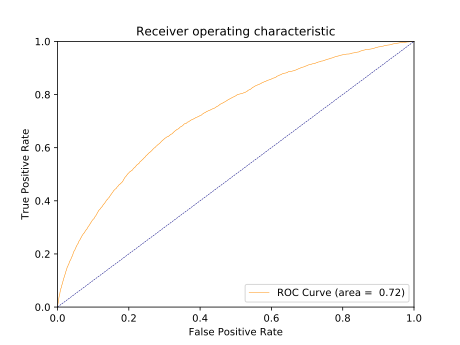
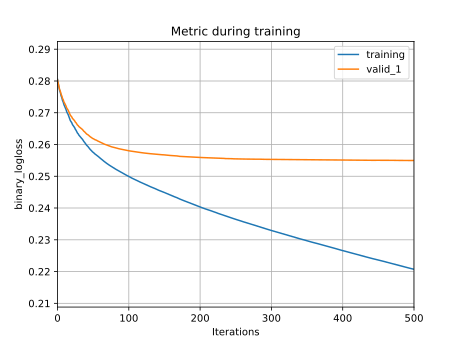

# Home Credit Default Risk Analysis

#### The Task

In this competition, we are going to preform a *binary classification*.

In the baseline model, only features from `application_train.csv` dataset are used.

## 1. Data Preprocessing

#### Notation

Each row of raw dataset represents one single *observation* (sample) and each column represents one *feature* or the *target*.

### 1.1. Dropping Invalid Data

#### 1.1.1. Basic

`SK_ID_CURR` and `TARGET` are excluded from training features.

#### 1.1.2. Dropping Invalid Features

Many of the columns in the raw dataset involves *invalid observations* (marked as `nan`).

One can specify a `DROP_THERSHOLD` parameter ranges from $0\%$ to $100\%$ (default at $10\%$). Features that are available for too few observations are considered as *invalid features*. Invalid features will not be involved in training.

With the default setting, $10\%$, features containing more than $10\%$ invalid observations will be considered as invalid features. And we have $63$ features left with the default $10\%$ threshold.

#### 1.1.3. Dropping Specific Features

One can specify a `DROP_COLUMNS` parameter to manually drop some features from the raw dataset. In our baseline model, no feature other than `SK_ID_CURR` and `TARGET` are dropped through this manner.

#### 1.1.4. Dropping Invalid Observations

After feature selection, observations still with `nan` feature(s) will be dropped, so that we won't have any `nan` element in our feature and target dataset for model training. With this dropping rule, less than $1\%(0.969\%) $of total observations is dropped from `application_train`.csv dataset.


### 1.2. Encoding Categorical Features

After feature selection, many of them are **categorical features** in string format. And they are encoded so that they can be fed into our model.

**Integer Encoder** is used in the baseline model, the encoder encodes categorical features with integer between 0 and $n\_class - 1$.


### 1.3. Splitting Training, Testing and Validation Sets

Selected feature and target datasets are splitted into training, testing and validation sets with splitting ratio of $(60\%, 20\%, 20\%)$.


### 1.4. Scaling Data

Generally, two methods of scaling, **normalization**, and **standardization**, are considered to handle features with significantly different ranges.

After integer-encoding categorical features, all features in the training set are in floating format. We can, therefore, scale them so that all features have similar distributions.

Specifically, since the testing set is unobservable for our model and validation set is used to simulate this property, we are going to fit our feature-scalers on the training set only.

Then, in the model validation phase and evaluate phase, feature-scalers are applied on validation and testing sets.

#### 1.4.1. Normalization

For each feature $j$, we fit a feature scaler from the training set. Let $\max(x_j)$ and $\min(x_j)$ denotes the largest and smallest observed values of feature $j$ in <u>training set</u>.

For each observation $x_{ij}$, the normalized proxy $z_{ij}$ is generated following equation below.

$z_{ij} = \frac{x_{ij} - \min(x_j)}{\max(x_j) - \min(x_j)}$

Note that after normalization, ranges of all features are normalized and bounded to $[0,1]$.

#### 1.4.2. Standardization

 For each feature $j$, firstly, the <u>training set</u> standard deviation and mean are calculated and denoted as $\sigma_{x_j}$ and $\overline{x}_j$.

Then, for each observation $x_{ij}$, the standardized proxy is generated from the equation below.

$z_{ij} = \frac{x_{ij} - \sigma_{x_j}}{\sigma_{x_j}}$

After standardization, every proxy feature has the same mean of $0$ and variance of 1.

Note that <u>In our model, standardization methods are used as default.</u>


## 2. Light Gradient Boosting Machine

### 2.1. Model Parameters

A light GBM classifier from `lightgbm`  package is used to fit the training set with parameters set as below. (Unmentioned parameters are set at their default values)

```python
params = {
    "learning_rate": 0.03,
    "boosting_type": "gbdt",
    "objective": "binary",
    "metric": ["binary_logloss", "auc"],
    "sub_feature": 0.5,
    "num_leaves": 64,
    "min_data": 50,
    "max_depth": 25,
    "max_bin": 512
}
```


### 2.2. Result

**Note** that the model log file for the model presented below can be found in `./documents/sample_lightgbm`

#### 2.2.1. Area Under Curve

After 500 boost round with model parameters specified above, the light GBM classifier achieved a $0.72$ AUC as shown below,



#### 2.2.2. Binary Log Loss

As mentioned above in model parameters, **binary log loss** is used for model training. The history of loss function through the 500 epochs of training is presented below



#### 2.2.3. Feature Importance

Business certainly care about how to evaluate the risk associated with loans and individuals.

| Feature                    | Score |
| -------------------------- | :---: |
| AMT_ANNUITY                | 2628  |
| EXT_SOURCE_2               | 2431  |
| DAYS_REGISTRATION          | 2346  |
| DAYS_BIRTH                 | 2295  |
| AMT_CREDIT                 | 2199  |
| DAYS_EMPLOYED              | 2185  |
| DAYS_LAST_PHONE_CHANGE     | 2080  |
| DAYS_ID_PUBLISH            | 2024  |
| AMT_GOODS_PRICE            | 1885  |
| AMT_INCOME_TOTAL           | 1456  |
| REGION_POPULATION_RELATIVE | 1340  |
| ORGANIZATION_TYPE          |  983  |
| HOUR_APPR_PROCESS_START    |  914  |
| WEEKDAY_APPR_PROCESS_START |  652  |
| OBS_30_CNT_SOCIAL_CIRCLE   |  481  |
| NAME_FAMILY_STATUS         |  402  |
| OBS_60_CNT_SOCIAL_CIRCLE   |  364  |
| NAME_EDUCATION_TYPE        |  363  |
| CODE_GENDER                |  342  |
| NAME_INCOME_TYPE           |  306  |